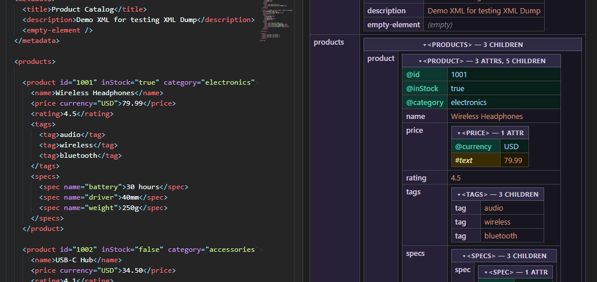

# XML Dump

XML Dump visualizes raw XML as an interactive dump view inspired by `cfdump`. Open a saved `.xml` file, an unsaved editor containing valid XML, selected XML text from any editor, or XML straight from the clipboard and inspect nested data in a dedicated webview with collapsible tables and switchable attribute ordering.

## Features

- Open saved `.xml` files directly from Explorer.
- Open an active unsaved editor as soon as its contents are valid XML; no save step required.
- Open selected XML text from the current editor with `XML Dump: Selection`.
- Open valid XML from the clipboard with `XML Dump: Clipboard`.
- Renders XML elements as nested tables with separate attribute and child rows.
- Collapse or expand nested structures from the header row or the key column.
- Expand or collapse every nested node at once with `Expand All` / `Collapse All` in the editor title while the dump panel is active.
- Toggle between natural attribute order and `Sort Attrs A->Z` from the editor title while the dump panel is active.
- Keeps leaf text and attributes easy to scan with distinct styling for elements, attributes, and scalar content.
- Validates XML before opening the dump viewer so invalid content is rejected early with a parser diagnostic.

## Usage

1. Open a saved `.xml` file from Explorer and run `XML Dump`, or paste valid XML into any editor tab and run `XML Dump` from the editor title menu, editor title context menu, editor context menu, or the Command Palette.
2. To render only part of a document, select valid XML text and run `XML Dump: Selection` from the editor title context menu, the editor context menu, or the Command Palette.
3. To skip the editor entirely, copy valid XML and run `XML Dump: Clipboard` from the Command Palette, editor title context menu, or the editor context menu.
4. The viewer opens in a new tab.
5. Explore nested nodes in the webview, collapse or expand nodes by clicking their key columns or headers.
6. Use `Sort Attrs A->Z` or `Natural Attr Order` in the editor title while the dump panel is active.
7. Use `Expand All` or `Collapse All` in the editor title to toggle every nested node at once.

## Changelog

Release notes are included with the extension changelog.
